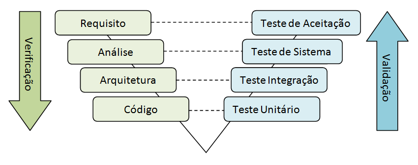

# NodeJs Avançado com Clean Architecture, NestJS e Typescript

Aplicando Clear Code, DDD e Clean Architecture em um projeto Nestjs + Docker + Prisma + Postgres.

# Sumário

* [Testes](#Testes)
* [Testes Unitários](#testes-unitários)
* [Testes de Integração](#testes-de-integração)

## Testes

Os testes desempenham um papel crucial no desenvolvimento de software, garantindo que o código funcione conforme o esperado e que problemas sejam identificados e corrigidos antes da entrega ao usuário final. A importância dos testes pode ser destacada em vários aspectos:

**1. Qualidade e Confiabilidade**

Os testes asseguram que o software atenda aos requisitos e funcione corretamente em diferentes cenários. Eles ajudam a identificar e corrigir bugs e falhas antes que o software chegue ao usuário, melhorando a qualidade geral e a confiabilidade do produto.

**2. Manutenção e Evolução**

À medida que o software evolui, novos recursos são adicionados e o código é modificado. Testes automatizados permitem verificar rapidamente se essas mudanças introduziram novos problemas. Isso é essencial para manter a integridade do software à medida que ele evolui e para garantir que novas funcionalidades não quebrem o que já foi implementado.

**3. Redução de Custos**

Detectar e corrigir problemas mais cedo no ciclo de desenvolvimento é geralmente menos caro do que fazê-lo depois que o software já foi liberado. Testes eficazes podem reduzir o custo de manutenção e minimizar o impacto financeiro de falhas graves encontradas após o lançamento.

**4. Documentação**

Testes bem projetados servem como uma forma de documentação para o software. Eles mostram como o software deve se comportar e fornecem exemplos de uso e requisitos esperados, ajudando desenvolvedores novos a entender melhor o sistema.

## Testes Unitários

O teste unitário consiste em verificar o comportamento das menores unidades em sua aplicação.
Tecnicamente, isso seria uma classe ou até mesmo um método de classe em línguas orientadas a objetos, e seria um procedimento ou função em línguas processuais e funcionais.
Funcionalmente, pode ser um conjunto de classes intimamente relacionadas. Como um “Cervo” e suas classes de suporte ”Cabeça”, “Rabo” e “Movimento”.
Testes unitários, assim como qualquer teste automatizados não servem principalmente para verificar se uma função específica está funcionando, mas sim para garantir que sua aplicação continue funcionando após alguma alteração em sua base de código.
Os testes unitários precisam funcionar isoladamente porque precisam funcionar rapidamente.
Todo o conjunto de testes unitários de uma aplicação precisa funcionar em minutos, de preferência em segundos.

**Quais os benefícios de um teste unitário?**

A importância do teste unitário é inegável, pois além de garantir a qualidade e a funcionalidade do código, ele também ajuda a evitar problemas mais sérios no futuro, pois erros são identificados e corrigidos de forma mais eficiente. Ademais, ele permite que os desenvolvedores trabalhem de forma mais ágil, pois eles podem fazer mudanças no código sem medo de quebrar outras partes do software.

* Melhoria da qualidade do código.
* Maior confiança na modificação.
* Aceleração do processo de desenvolvimento.
* Redução dos custos.
* Melhoria da colaboração.

## Testes de Integração

Teste de integração é a fase do teste de software em que módulos são combinados e testados em grupo. Ela sucede o teste de unidade, em que os módulos são testados individualmente, e antecede o teste de sistema, em que o sistema completo (integrado) é testado num ambiente que simula o ambiente de produção.
O teste de integração é alimentado pelos módulos previamente testados individualmente pelo teste de unidade, agrupando-os assim em componentes, como estipulado no plano de teste, e resulta num sistema integrado e preparado para o teste de sistema.
O propósito do teste de integração é verificar os requisitos funcionais, de desempenho e de confiabilidade na modelagem do sistema. Com ele é possível descobrir erros de interface entre os componentes do sistema.

**Quais falhas o teste de integração consegue identificar?**

O teste de integração é uma etapa essencial para garantir a qualidade do software. Ao identificar e corrigir falhas de interface, o teste de integração ajuda a garantir que o sistema funcione corretamente e de forma confiável.

**1. Dados perdidos ou corrompidos**

Erros de dados ocorrem quando os dados são corrompidos ou perdidos durante a transferência entre módulos. Isso pode acontecer por vários motivos, como:

* Problemas de comunicação: Os dados podem ser corrompidos durante a transmissão.
* Erros de programação: Os módulos podem não estar usando os dados corretamente.
* Problemas de hardware: Os dispositivos de armazenamento de dados podem estar danificados.

**2. Erros de sintaxe ou semântica nos dados**

São erros que ocorrem quando os dados não estão no formato esperado pelo módulo receptor. Esses erros podem ser causados por vários motivos, como:

* Erros de digitação: O módulo transmissor pode digitar os dados incorretamente.
* Erros de programação: O módulo transmissor pode não estar usando o formato de dados correto.
* Problemas de comunicação: Os dados podem ser corrompidos durante a transmissão.

**3. Diferenças nos resultados esperados**

São diferenças entre os resultados reais e os resultados esperados de um teste de integração. Essas diferenças podem ser causadas por vários motivos, como:

* Erros de programação: Um módulo pode estar calculando os resultados incorretamente.
* Erros de dados: Os dados que estão sendo usados ​​no teste podem estar incorretos.
* Problemas de comunicação: Os dados podem ser corrompidos durante a transmissão.

**4. Comportamento inesperado dos módulos em combinação**

Comportamento inesperado ocorre quando os módulos exibem um comportamento diferente do esperado. Isso pode acontecer por vários motivos, como:

* Erros de programação: Os módulos podem conter bugs ou podem não estar funcionando conforme especificado.
* Problemas de hardware: Os dispositivos de hardware podem estar danificados.
* Interferência de outros aplicativos: Outros aplicativos podem estar interferindo no funcionamento dos módulos.
