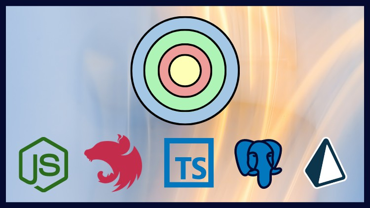

# NodeJs Avançado com Clean Architecture, NestJS e Typescript

Aplicando Clear Code, DDD e Clean Architecture em um projeto Nestjs + Docker + Prisma + Postgres.

## Sumário

* [Resumo](#resumo)
* [Testes](/readme/testes.md#testes)
    1. [Testes Unitários](/readme/testes.md#testes-unitários)
    2. [Testes de Integração](/readme/testes.md#testes-de-integração)
    3. [Testes de Ponta a Ponta (E2E)](/readme/testes.md#testes-de-ponta-a-ponta-e2e)
* [DDD](/readme/ddd.md#ddd-domain-driven-design)
    1. [Domínio](/readme/ddd.md#domínio)
    2. [Modelo](/readme/ddd.md#modelo)
    3. [Linguagem Ubíqua](/readme/ddd.md#linguagem-ubíqua)
    4. [Objetos de Domínio](/readme/ddd.md#objetos-de-domínio)
        1. [Entidades e Objetos de Valor](/readme/ddd.md#entidades-e-objetos-de-valor)
        2. [Serviços](/readme/ddd.md#serviços)
        3. [Agregados](/readme/ddd.md#agregados)
        4. [Repositórios](/readme/ddd.md#repositórios)
    5. [Contextos Delimitados](/readme/ddd.md#contextos-delimitados)
    6. [Camada Anticorrupção](/readme/ddd.md#camada-anticorrupção)
    7. [Resumo](/readme/ddd.md#resumo)
* [Clean Architecture](/readme/clean-architecture.md#clean-architecture)
    1. [Princípios Fundamentais do Clean Architecture](/readme/clean-architecture.md#princípios-fundamentais-do-clean-architecture)
    2. [Estrutura do Clean Architecture](/readme/clean-architecture.md#estrutura-do-clean-architecture)
* [Integração Contínua e Entrega Contínua (CI/CD)](/readme/ci_cd.md#integração-contínua-e-entrega-contínua-cicd)
    1. [Integração Contínua (CI)](/readme/ci_cd.md#integração-contínua-ci)
    2. [Entrega Contínua (CD)](/readme/ci_cd.md#entrega-contínua-cd)
    3. [Processo](/readme/ci_cd.md#processo)
    4. [Ferramentas Comuns para CI/CD](/readme/ci_cd.md#ferramentas-comuns-para-cicd)

## Resumo

O projeto tem como objetivo fornecer uma base sólida para o desenvolvimento de aplicações escaláveis e de fácil manutenção usando o ecossistema Node.js. Este projeto utiliza tecnologias e práticas avançadas, como NestJS, TypeScript e Clean Architecture, para estruturar e organizar o código de maneira eficiente.

**Objetivos do Projeto**

* Uso do NestJS: Este framework para Node.js facilita o desenvolvimento de aplicativos server-side eficientes e escaláveis. Ele é construído com TypeScript e utiliza fortemente conceitos de programação orientada a objetos, funcional e reativa. No projeto, o NestJS é usado para estruturar a aplicação em módulos bem definidos, como controladores, serviços e repositórios.

* TypeScript: A escolha do TypeScript é para aproveitar o suporte à tipagem estática e recursos modernos de JavaScript, como interfaces e tipos genéricos, que ajudam a evitar erros comuns e melhorar a manutenção do código.

* Clean Architecture: Adotar a Clean Architecture promove a separação de preocupações e a independência das camadas da aplicação. Isso significa que as regras de negócio estão isoladas das preocupações técnicas, como interfaces de usuário, frameworks, bancos de dados e outras dependências externas. No contexto deste projeto, a Clean Architecture ajuda a manter o código limpo, testável e modular.

## Referências

- [Udemy](https://www.udemy.com/course/nodejs-avancado-com-clean-architecture-nestjs-typescript/)
- [Eng Softmoderna](https://engsoftmoderna.info/artigos/ddd.html)
- [Clean Architecture](https://medium.com/luizalabs/descomplicando-a-clean-architecture-cf4dfc4a1ac6)
- [Chat GPT](https://chat.openai.com/)
- [Intensivo Domain Driven Design (DDD): Os 3 pilares que você precisa saber](https://www.youtube.com/live/vFZkOyaPK4E)
- [Domain Driven Design do Jeito Certo](https://www.youtube.com/live/cz6EU7Z_BhE)
- [Clean Architecture](https://www.youtube.com/live/BuSf7VsH064)
