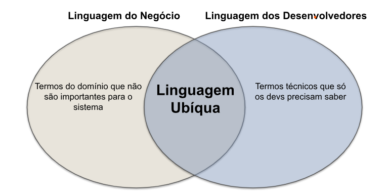

## DDD (Domain Driven Design)

Software é um instrumento criado para ajudar a lidar com as complexidades da vida moderna. Software é apenas um meio par aum fim, e normalmente isso é algo muito prático e real.

Software tem que ser prático e útil; caso contrário, não iria investir tanto tempo e recursos para sua criação. Um pacote útil de software não pode ser dissociado do que espera da realidade, o domínio é suposto para nos ajudar a gerir.

Design de software é uma arte, e como qualquer arte, não pode ser ensinada e aprendida como uma ciência exata por meio de teoremas e fórmulas.

A fim de criar um bom software, é necessário saber a causa da software. Em outras palavras, é preciso entender o domínio da causa.

### Domínio

Quando é iniciado um projeto de software, é preciso ter uma concentração maior no domínio que está operando dentro. Todo propósito de um software é aumentar um domínio específico.

Tornando um software um reflexo do domínio facilita em deixar a relação entre os dois mais harmoniosa. O software precisa incorporar os conceitos e elementos do domínio do núcleo, e precisamente perceber as relações entre eles. Software tem que modelar o domínio.

Software que não tem suas raízes plantadas profundamente no domínio não reagem bem ás mudanças ao longo do tempo.

O domínio de um sistema consiste da área e problema de negócio que ele pretende resolver.

DDD defende que os desenvolvedores devem ter um profundo conhecimento do domínio do sistema que eles desenvolvem. Esse conhecimento deve ser obtido por meio de conversas e discussões frequentes com especialistas no domínio (ou no negócio). Portanto, o design do sistema deve ser norteado para atender ao seu domínio.

É importante mencionar que DDD se sobressai quando é usado em sistemas para domínios complexos, cujas regras de negócio são mais difíceis de serem imediatamente entendidas e implementadas pelos desenvolvedores.

### Modelo

O modelo é a representação do domínio de destino, ele é muito necessário em todo o processo de desenvolvimento de design.

Existem diferentes abordagens para design de software, um deles é o método de projeto cachoeira. Este método envolve uma série de etapas. Os especialistas em negócios colocam um conjunto de requisitos que são comunicados aos analistas de negócios. Os Analistas criam um modelo com base nesses requisitos, assim passando os resultados para os desenvolvedores.

### Linguagem Ubíqua

Linguagem Ubíqua (ou Linguagem Onipresente) é um conceito central de DDD. Ela consiste de um conjunto de termos que devem ser plenamente entendidos tanto por especialistas no domínio (usuários do sistema) como por desenvolvedores (implementadores do sistema).

Para um projeto de software dar certo, DDD defende que esses dois papéis – especialistas no domínio e desenvolvedores – devem falar a mesma língua, que vai constituir a chamada Linguagem Ubíqua do sistema. Essa ideia é ilustrada na seguinte figura:

### Objetos de Domínio

DDD foi proposto pensando em sistemas implementados em linguagens orientadas a objetos. Então, quando se define o design desses sistemas, alguns tipos importantes de objetos se destacam. Dentre eles, DDD lista os seguintes:

* Entidades
* Objetos de Valor
* Serviços
* Agregados
* Repositórios

Esses tipos de objetos de domínio devem ser entendidos como as ferramentas conceituais que um projetista deve lançar mão para projetar com sucesso um determinado sistema. Por isso, eles são chamados também dos building blocks de DDD.

#### Entidades e Objetos de Valor

Uma entidade é um objeto que possui uma identidade única, que o distingue dos demais objetos da mesma classe. Por exemplo, cada Usuário da nossa biblioteca é uma entidade, cujo identificador é o seu número de matrícula na universidade.

Por outro lado, objetos de valor (value objects) não possuem um identificador único. Assim, eles são caracterizados apenas por seu estado, isto é, pelos valores de seus atributos. Por exemplo, o Endereço de um Usuário da biblioteca é um objeto de valor. Veja que se dois Endereços tiverem exatamente os mesmos valores para rua, número, cidade, CEP, etc, eles serão idênticos.

Outros exemplos de objetos de valor incluem: Moeda, Data, Fone, Email, Hora, Cor, etc.

*Por que distinguir entre entidades e objetos de valor?* Entidades são objetos mais importantes e devemos, por exemplo, projetar com cuidado como eles serão persistidos e depois recuperados de um banco de dados. Devemos também tomar cuidado com o ciclo de vida de entidades. Por exemplo, podem existir regras que governam a criação e remoção de entidades. No caso da nossa biblioteca, não se pode remover um Usuário se ele tiver um Empréstimo pendente.

Já objetos de valor são mais simples. E também eles devem ser imutáveis, ou seja, uma vez criados, não deve ser possível alterar seus valores internos. Por exemplo, para alterar o Endereço de um Usuário devemos abandonar o objeto antigo e criar um objeto com o Endereço novo.

#### Serviços

Existem operações importantes do domínio que não se encaixam em entidades e objetos de valor. Assim, o ideal é criar objetos específicos para implementar essas operações. No jargão de DDD, esses objetos são chamados de serviços. Em alguns sistemas, é comum ver esses objetos sendo chamados também de gerenciadores ou controladores.

A assinatura das operações de um objeto de serviço pode incluir entidades e objetos de valor. No entanto, objetos de serviço não devem possuir estado, isto é, eles devem ser stateless. Por isso, eles não costumam ter atributos, mas apenas métodos.

Serviços normalmente são implementados como singletons, ou seja, possuem uma única instância durante a execução do sistema.

#### Agregados

Agregados (aggregates) são coleções de entidades e objetos de valor. Ou seja, algumas vezes não faz sentido raciocinar sobre entidades e objetos de valor de forma individual. Em vez disso, temos que pensar em grupos de objetos para ter uma visão consistente com o domínio que estamos modelando.

Um agregado possui um objeto raiz, que deve ser uma entidade. Externamente, o agregado é acessado a partir dessa raiz. A raiz, por sua vez, referencia os objetos internos do agregado. Porém, esses objetos internos não devem ser visíveis para o resto do sistema, ou seja, apenas a raiz pode referenciá-los.

Como eles são objetos mais complexos e com objetos internos, pode ser interessante implementar métodos especificamente para criação de agregados, os quais são chamados de fábricas. Ou seja, tais métodos são implementações do padrão de projeto de mesmo nome.

#### Repositórios

Um repositório é então um objeto usado para recuperar outros objetos de domínio de um banco de dados. Seu objetivo é prover uma abstração que blinde os desenvolvedores de preocupações relacionadas com acesso a bancos de dados. Normalmente, repositórios são criados para recuperar entidades ou agregados.

Em outras palavras, um repositório oferece uma abstração para o banco de dados usado pelo sistema e, assim, permite que os desenvolvedores continuem focados no domínio, em vez de ter sua atenção desviada, em certos momentos, para uma tecnologia de armazenamento de dados.

### Contextos Delimitados

Com o tempo, sistemas de software ficam mais complexos e abrangentes. Por isso, é irrealista imaginar que sistemas de organizações grandes e complexas vão possuir um modelo de domínio único e baseado na mesma linguagem ubíqua.

Em vez disso, é natural que tais organizações tenham sistemas que atendem a usuários com perfis e necessidades diferentes, o que complica a definição de uma linguagem ubíqua. A solução para esse problema consiste em quebrar tais domínios complexos em domínios menores, os quais em DDD são chamados de Contextos Delimitados (Bounded Contexts).

### Camada Anticorrupção

Às vezes, temos que integrar sistemas que estão em contextos delimitados diferentes. Por exemplo, um sistema A precisa usar serviços de um sistema B, que pode inclusive ser um sistema externo, isto é, de uma outra organização. Para evitar que A tenha que se adaptar e usar, mesmo que parcialmente, a linguagem ubíqua de B, pode-se usar uma Camada Anticorrupção para mediar essa comunicação.

Essa camada é formada por três tipos principais de classes:

* Classes de Serviço, cujos métodos serão chamados por A e que, portanto, seguem a linguagem ubíqua desse sistema.

* Classes Adaptadoras, que convertem o modelo e os tipos de dados de B para o modelo e tipos de dados de A. Ou seja, essas classes vão isolar elementos próprios de B e evitar que eles cheguem até o sistema A.

* Uma Classe de Fachada, usada para acessar o sistema B. O papel dessa classe é facilitar o uso de B, principalmente quando ele é um sistema legado com uma interface complexa e antiga.

### Resumo

O DDD (Domain Driven Design) foca em atacar a complexidade no coração do Software. Ele não terá muita utilidade para um simples CRUD, mas para uma empresa que existe varios setores e que cada setor
